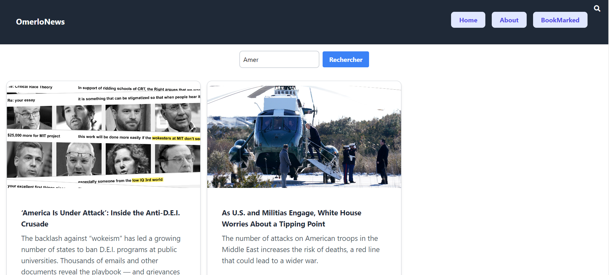

# NewsWebsite-Sveltkit-
OmerloNews, un site d'actualités interactif, utilise l'API du New York Times et est construit avec SvelteKit, TypeScript et TailwindCSS. Il offre une barre de recherche, des bookmarks d'articles et une conception responsive, démontrant efficacement les compétences en développement front-end moderne.

